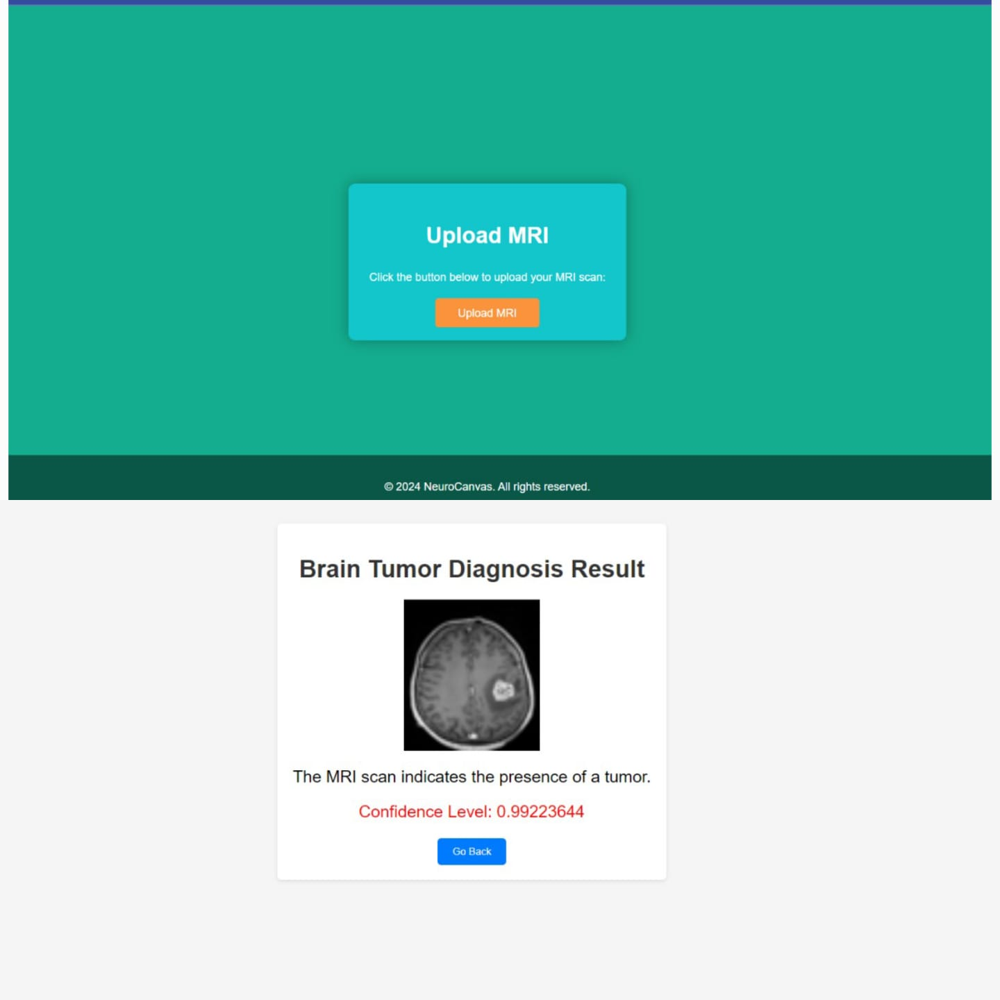

# NeuroCanvas

NeuroCanvas is a deep learning project focused on brain tumor classification using Convolutional Neural Networks (CNNs). It leverages state-of-the-art architectures like DenseNet, MobileNet, and VGG19 to provide accurate tumor detection for medical applications.


## Features
- **Brain Tumor Classification**: Uses advanced CNN architectures.
- **Deep Learning Frameworks**: Built with TensorFlow and Keras.
- **Model Comparison**: Evaluates performance of DenseNet, MobileNet, and VGG19.
- **User-Friendly Interface**: Simplifies complex neural network analysis.


## Model Implementations  
### 1. CNN (Convolutional Neural Network)  
- **Description**: CNNs are specifically designed for image processing tasks. They consist of convolutional layers, pooling layers, and fully connected layers, making them adept at capturing spatial hierarchies in images.  
- **Accuracy**: 91%  

### 2. EfficientNetB3  
- **Description**: EfficientNet uses a compound scaling method to balance network depth, width, and resolution, achieving state-of-the-art performance with computational efficiency.  
- **Accuracy**: 98%  

### 3. Inception (GoogLeNet)  
- **Description**: Inception introduced the concept of inception modules, which consist of multiple parallel convolutional layers with different filter sizes, capturing features at various spatial scales efficiently.  
- **Accuracy**: 99%  

### 4. ResNet (Residual Neural Network)  
- **Description**: ResNet introduced residual learning, where each layer learns residual functions with reference to the layer inputs. This architecture mitigates the vanishing gradient problem and enables the training of extremely deep networks.  
- **Accuracy**: 99%  

### 5. DenseNet121 (Densely Connected Convolutional Network)  
- **Description**: DenseNet employs densely connected layers, facilitating feature reuse and propagation throughout the network. This architecture addresses the vanishing gradient problem and promotes parameter efficiency.  
- **Accuracy**: 78%  

### 6. VGG19  
- **Description**: VGG19 is a variant of the VGG architecture, known for its simplicity and uniform structure. It consists of 19 layers, including convolutional and fully connected layers.  
- **Accuracy**: 85%  

### 7. MobileNet  
- **Description**: MobileNet is designed for efficient mobile and embedded vision applications. It utilizes depthwise separable convolutions, significantly reducing computational cost while maintaining good accuracy.  
- **Accuracy**: 96.2%  

### 8. AlexNet  
- **Description**: AlexNet was one of the pioneering deep convolutional neural networks, popularizing the use of ReLU activations and dropout regularization.  
- **Accuracy**: 92.1%  

### 9. LeNet-5  
- **Description**: LeNet-5 is one of the earliest CNN architectures, primarily designed for handwritten digit recognition tasks. It laid the groundwork for modern CNN architectures.  
- **Accuracy**: 97.4%  

---

## Dataset
The project utilizes publicly available medical imaging datasets for training and testing.

## Technologies Used
- **Programming Language**: Python
- **Frameworks/Libraries**: TensorFlow, Keras, NumPy, Pandas, Matplotlib

## How to Use
1. Clone the repository:
   ```bash
   git clone https://github.com/kanikac199/NeuroCanvas-Brain-tumor-classifier-/new/main.git
